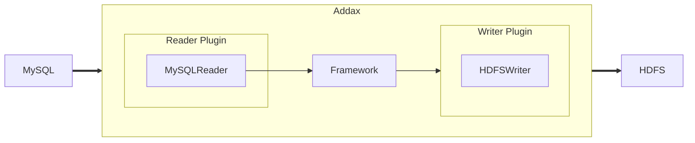
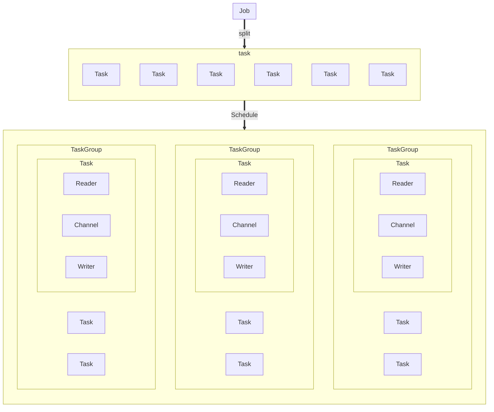

# Introduction

## Overview

Addax is a heterogeneous data source offline synchronization tool, originally derived from Alibaba's [DataX](https://github.com/alibaba/datax), dedicated to achieving stable and efficient data synchronization between various heterogeneous data sources including relational databases (MySQL, Oracle, etc.), HDFS, Hive, HBase, FTP, and more.


To solve the problem of heterogeneous data source synchronization, Addax transforms complex mesh synchronization links into star-shaped data links. Addax acts as an intermediate transmission carrier responsible for connecting various data sources. When a new data source needs to be integrated, it only needs to be connected to Addax to achieve seamless data synchronization with existing data sources.

## Framework Design



Addax itself, as an offline data synchronization framework, is built using a Framework + plugin architecture. It abstracts data source reading and writing into Reader/Writer plugins, integrating them into the entire synchronization framework.

- Reader: Reader is the data collection module responsible for collecting data from the data source and sending it to the Framework.
- Writer: Writer is the data writing module responsible for continuously fetching data from the Framework and writing it to the destination.
- Framework: Framework connects the reader and writer, serving as the data transmission channel between them, and handles core technical issues such as buffering, flow control, concurrency, and data transformation.

The Addax Framework provides simple interfaces for plugin interaction and a straightforward plugin integration mechanism. By adding any plugin, it can seamlessly connect to other data sources.

## Architecture

This section briefly explains the relationship between various modules through a sequence diagram of an Addax job lifecycle.



### Core Module Introduction

1. Addax completes a single data synchronization job, referred to as a Job. After receiving a Job, Addax will start a process to complete the entire job synchronization process. The Addax Job module is the central management node of a single job, responsible for data cleaning, sub-task splitting (converting a single job calculation into multiple sub-tasks), and TaskGroup management.
2. After the Addax Job starts, it will split the Job into multiple smaller Tasks (sub-tasks) based on different source-side splitting strategies for concurrent execution. A Task is the smallest unit of an Addax job, with each Task responsible for synchronizing a portion of the data.
3. After splitting multiple Tasks, the Addax Job will call the Scheduler module to recombine the split Tasks into TaskGroups (task groups) based on the configured concurrency. Each TaskGroup is responsible for running all assigned Tasks with a certain level of concurrency, with a default concurrency of 5 per task group.
4. Each Task is started by the TaskGroup. After the Task starts, it will consistently start the `Reader—>Channel—>Writer` threads to complete the task synchronization.
5. Once the Addax job is running, the Job monitors and waits for the completion of multiple TaskGroup modules. The Job successfully exits after all TaskGroup tasks are completed. Otherwise, it exits abnormally with a non-zero exit code.

### Scheduling Process

For example, if a user submits a job with a configuration of 20 concurrent tasks to synchronize data from 100 MySQL sub-tables to Oracle, the scheduling decision process is as follows:

1. The Addax Job splits into 100 Tasks based on the sub-table strategy.
2. Based on 20 concurrent tasks, it calculates that `20/5 = 4` TaskGroups are needed.
3. The 4 TaskGroups evenly split the 100 Tasks, with each TaskGroup responsible for running 25 Tasks with 5 concurrent tasks.

## Core Advantages

### Reliable Data Quality Monitoring

- Perfectly solves the problem of data transmission distortion for certain types

  Supports all strong data types, with each plugin having its own data type conversion strategy, ensuring data can be transmitted to the destination without loss.

- Provides full-link traffic and data volume runtime monitoring

  During operation, it can comprehensively display the job's status, data flow, data speed, execution progress, and other information, allowing users to understand the job status in real-time. It can also intelligently judge the speed comparison between the source and destination during job execution, providing users with more performance troubleshooting information.

- Provides dirty data detection

  During the transmission of large amounts of data, various reasons can cause many data transmission errors (such as type conversion errors). Addax considers such data as dirty data. Addax can currently achieve precise filtering, identification, collection, and display of dirty data, providing users with multiple dirty data handling modes to accurately control data quality!

### Rich Data Transformation Functions

As a big data ETL tool, in addition to providing data snapshot migration functions, it also offers rich data transformation functions, allowing data to be easily desensitized, completed, filtered, and more during transmission. Additionally, it provides automatic `groovy` functions for users to define custom transformation functions. For details, see the [transformer](transformer) introduction.

### Precise Speed Control

Provides three flow control modes: channel (concurrency), record flow, and byte flow, allowing you to control your job speed at will, achieving the best synchronization speed within the database's tolerable range.

```json
{
  "speed": {
    "channel": 5,
    "byte": 1048576,
    "record": 10000
  }
}
```

### Strong Synchronization Performance

Each read plugin has one or more splitting strategies, allowing jobs to be reasonably split into multiple parallel Tasks. The single-machine multi-threaded execution model can make the speed increase linearly with concurrency. When both the source and destination performance are sufficient, a single job can fully utilize the network card.

### Robust Fault Tolerance Mechanism

Jobs are highly susceptible to external factors such as network interruptions and unstable data sources, which can easily cause job errors and stops during synchronization. Therefore, stability is a basic requirement for Addax. In Addax's design, the stability of the framework and plugins has been a key focus. Currently, Addax can achieve multi-level local/global retries at the thread and job levels, ensuring stable job operation for users.# Addax 介绍
